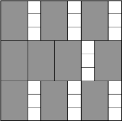

# A. Упаковка прямоугольников

Есть n  прямоугольников одинакового размера: w  в ширину и h  в длину. Требуется найти квадрат минимального размера, в который можно упаковать данные прямоугольники. Прямоугольники при этом нельзя поворачивать.  



## Входные данные
Ввод содержит три целых числа: w, h, n (1 &le; w, h, n &le; 10<sup>9</sup>).

### Выходные данные
Выведите минимальную длину стороны квадрата, в который можно упаковать заданные прямоугольники.

### Пример

**Входные данные**
```
2 3 10
```

**Выходные данные**
```
9
```
